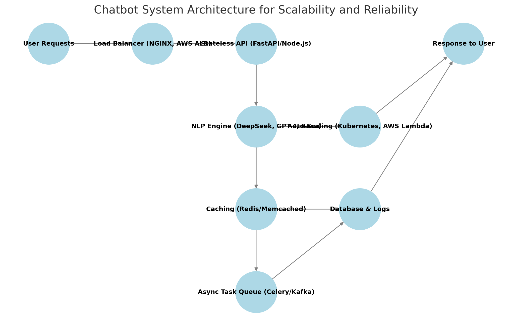

# Enhancing Customer Support with Chatbot Integration

## 1. Requirement Gathering and Planning

### 1.1 Understanding Functional Requirements & Scope
To define the functional requirements and scope of the chatbot, the following steps will be taken:
- **Analyzing Existing Support System**: Review historical chat logs, FAQs, and customer support tickets to identify high-frequency queries and repetitive tasks.
- **Defining Chatbot Capabilities**: Determine whether the chatbot should handle FAQs, appointment bookings, troubleshooting, or advanced AI-driven interactions.
- **User Journey Mapping**: Develop user stories and conversation flow diagrams to outline chatbot interactions and escalation paths.
- **Technical Feasibility Study**: Assess integration requirements with CRM, databases, and third-party APIs while ensuring compliance with data security regulations.
- **Validation & Iteration**: Review the proposed scope with stakeholders, gather feedback, and refine chatbot objectives before proceeding to development.

### 1.2 Deciding Between a Custom Chatbot and an Off-the-Shelf Solution
The decision to build a custom chatbot or use an off-the-shelf solution depends on several factors:

| Criteria                | Custom Chatbot  | Off-the-Shelf Solution  |
|-------------------------|----------------|-------------------------|
| **Customization**       | Fully customizable (intent recognition, response structure, branding) | Limited to predefined configurations and templates |
| **Scalability**         | Scalable based on business growth and user demands | May have constraints on concurrent user handling and feature expansion |
| **Integration Needs**   | Can be deeply integrated with internal systems (CRM, databases, APIs) | Typically supports only popular third-party integrations |
| **Development Time & Cost** | Higher upfront cost and longer development cycle | Faster deployment and cost-effective |
| **AI & NLP Capabilities** | Can leverage state-of-the-art models (DeepSeek, GPT-4, RAG, CAG) | Often limited to vendor-provided NLP models |
| **Data Security & Compliance** | Full control over user data and compliance standards (HIPAA, GDPR) | Relies on vendor policies, may have restrictions |

#### When to Choose a Custom Chatbot:
- If the business requires highly personalized interactions or domain-specific expertise.
- When deep CRM and API integrations are necessary.
- If data security, compliance, and control over AI models are a priority.
- For companies looking to continuously improve the chatbot using reinforcement learning (RLHF).

#### When to Choose an Off-the-Shelf Solution:
- If a quick deployment is required with minimal customization.
- When the use case is simple, such as handling FAQs and basic workflows.
- If budget constraints do not allow for a full custom AI model development.
- When the company does not have in-house AI/ML expertise to maintain a custom model.

#### Recommended Approach:
A **hybrid model** can be considered, where an off-the-shelf chatbot is deployed initially to handle basic queries, while a custom chatbot is developed in parallel for long-term scalability and deeper integrations.

### 1.3 Ensuring User Accessibility and Data Privacy Standards
To ensure the chatbot meets user accessibility and data privacy standards, the following factors will be considered:

#### **Accessibility Considerations:**
- **Simple & Clear UI Design**: Optimize chatbot interface for ease of interaction, including high-contrast text and screen-reader compatibility.
- **Multimodal Interaction**: Support voice-to-text, text-to-speech, and keyboard navigation for ease of use.
- **Language Support**: Implement multilingual capabilities to cater to diverse user demographics.
- **User Personalization**: Adapt chatbot responses based on user behavior and preferences to improve engagement.

#### **Data Privacy and Security Considerations:**
- **End-to-End Encryption**: Secure all user data transmissions and storage with AES-256 encryption.
- **Compliance with Regulations**: Ensure adherence to GDPR, HIPAA, and CCPA to protect user data privacy.
- **Role-Based Access Control (RBAC)**: Restrict chatbot data access to authorized personnel only.
- **Data Minimization**: Collect only necessary data and ensure user consent before processing any sensitive information.
- **Incident Response Plan**: Establish protocols for detecting and responding to security breaches and data leaks.
- **User Anonymization**: Where applicable, anonymize data to reduce risk exposure in compliance with privacy laws.

## 2. Chatbot Design and Development

### 2.1 Chatbot System Architecture for Scalability and Reliability
To ensure scalability and reliability, the chatbot system will follow a **microservices architecture** with load balancing and containerization.

#### **Key Components:**
- **Load Balancer (NGINX, AWS ALB)**: Distributes traffic efficiently across chatbot instances.
- **Stateless API (FastAPI/Node.js)**: Ensures independent scaling of chatbot interactions.
- **NLP Engine (DeepSeek, OpenAI GPT-4, Rasa)**: Handles complex natural language understanding.
- **Caching Mechanism (Redis/Memcached)**: Improves response time by storing frequent queries.
- **Asynchronous Task Queue (Celery/Kafka)**: Manages long-running processes without blocking interactions.
- **Auto-Scaling (Kubernetes, AWS Lambda)**: Ensures reliability under high traffic loads.

  
#### **Architecture Design:**

### 2.2 Core Features to Prioritize
- **Advanced Natural Language Processing (NLP)**: For accurate understanding and contextual conversation.
- **Multi-Language Support**: Expands accessibility across different demographics.
- **Omnichannel Integration**: Deploy chatbot across web, mobile, and social media platforms.
- **Real-Time Learning & Personalization**: Adapts responses based on user behavior and feedback.
- **Seamless Human Escalation**: Transfers complex queries to human agents with full chat history.
- **Proactive Notifications & Reminders**: Sends automated appointment confirmations and reminders.

### 2.3 Handling Intent Recognition & Dialogue Flow
- **Pre-Trained LLMs & Fine-Tuning**: Use RAG and CAG-based fine-tuned LLMs for domain-specific understanding.
- **Intent Classification Models**: Implement intent detection with Transformer-based NLP models (BERT, GPT, T5).
- **Dialogue State Tracking (DST)**: Ensures continuity in multi-turn conversations.
- **Context Retention Mechanism**: Uses memory-based embeddings (FAISS/Pinecone) to maintain user context.
- **Fallback Handling & Retraining**: Continual model improvements based on real-time user interactions.

## 3. Integration with Existing Systems

### 3.1.1 CRM & Ticketing System Integration
- **API-Based Integration**: Utilize RESTful or GraphQL APIs to sync chatbot interactions with CRM platforms like Zendesk or Salesforce.
- **Webhook Triggers**: Automatically escalate unresolved queries by triggering tickets in the CRM system.
- **Automated Tagging & Categorization**: Use AI-driven tagging to classify support requests before escalation.
- **Two-Way Synchronization**: Ensure updates from human agents in the CRM are reflected in chatbot responses.
- **Access Control & Logging**: Maintain logs for each customer interaction to comply with security and audit requirements.

## 4. Data Handling and Security

### 4.1 Ensuring Secure Handling of Sensitive Customer Data
- **Data Encryption**: Use AES-256 encryption for data at rest and TLS 1.2+ for data in transit.
- **Compliance Standards**: Adhere to GDPR, HIPAA, and CCPA for data protection.
- **User Consent & Data Minimization**: Collect only necessary data with explicit user consent.
- **Regular Audits & Monitoring**: Implement real-time monitoring for unauthorized data access and breaches.

## 5. Performance Optimization and Scalability

### 5.1 Monitoring Performance and Response Times
- **Logging & Metrics Collection**: Use tools like Prometheus and Grafana to monitor API response times, latency, and uptime.
- **Real-Time Alerting**: Implement monitoring with AWS CloudWatch or Datadog for immediate issue detection.

## 6. Measuring Success and Iteration

### 6.1 Key Performance Indicators (KPIs)
- **First Response Time (FRT)**
- **Resolution Rate**
- **Customer Satisfaction Score (CSAT)**
- **Retention Rate**
- **Escalation Rate**
- **Conversion Rate**
